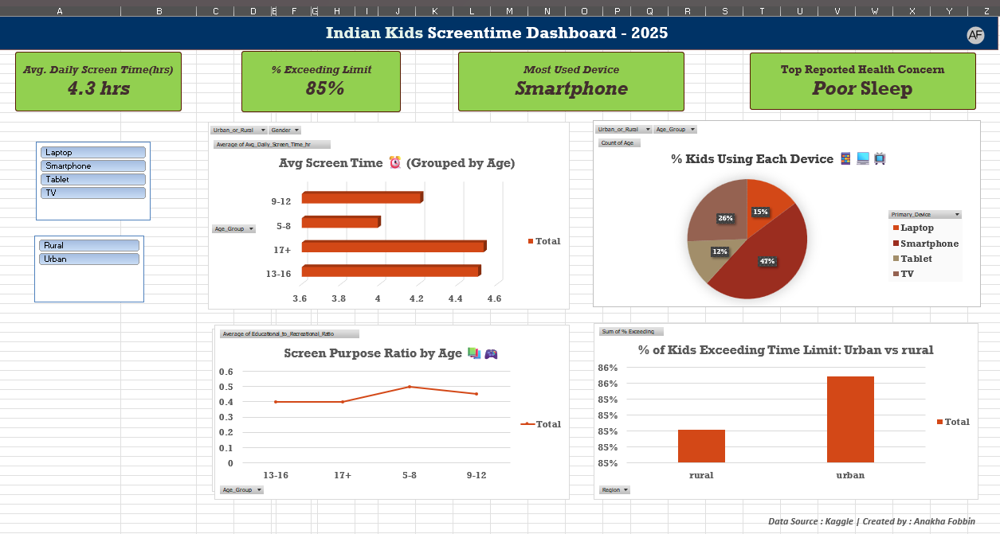

# Indian Kids Screentime Dashboard-2025
This is an interactive Excel dashboard project analyzing screentime behavior among Indian kids using a real-world dataset from Kaggle.

## 🔍 Project Objective
To explore how Indian children use dugital devices, how often they exceed recommended screentime limits, and what health impacts are reported.

## 📌 Key Features 
- Pivot tables and slicers for interactivity
- KPIs: Avg. Screentime, % Exceeding Limit, Most Used Device, etc.
- Visuals: Bar chart, Pie chart, Line graph
- Branded dashboard with clean design and custom logo

  ## 🧰 Tools Used
  - Microsoft Excel (pivot Tables, Charts, Slicers, Conditional Formatting)
  - Dataset: [Kaggle Dataset]*(https://www.kaggle.com/datasets/ankushpanday2/indian-kids-screentime-2025)*
 
    ## 📷 Dashboard Preview
    

 ## ✍️ Created by
**Anakha Fobbin**  
Aspiring Data Analyst | Excel • SQL • Python (Learning)
